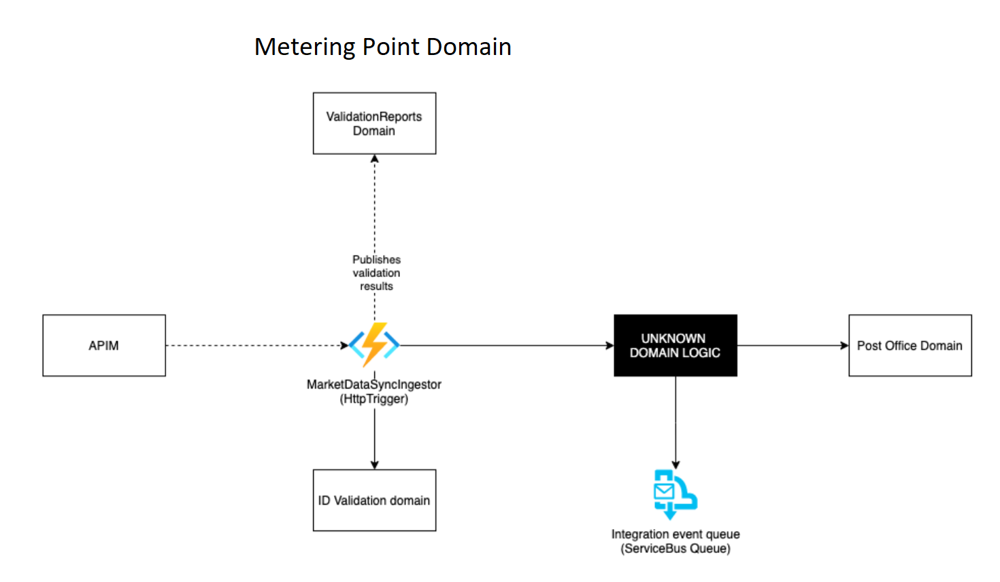

# MeteringPoints

## Intro

The metering point domain is in charge of maintaining grid areas and creating the different metering point types in their respective grid areas, as well as maintaining the metering point state.
Furthermore the domain supports metering point master data updates not related to an energy supplier or consumer updates.

These are the processes maintained by this domain.

| Process                                                                      |
| ---------------------------------------------------------------------------- |
| [Create Metering Point](docs/business-processes/create-metering-point.md) |
| [Submission of master data – grid access provider](docs/business-processes/submission-of-master-data-grid-acess-provider.md)                |
| [Close down metering point](docs/business-processes/close-down-metering-point.md)                                               |
| [Connection of metering point with status new](docs/business-processes/connection-of-metering-point-with-status-new.md)                                             |
| [Disconnect or reconnect metering point](docs/business-processes/disconnect-or-reconnect-metering-point.md)                                                            |
| [Change of settlement method](docs/business-processes/change-of-settlement-method.md)                                                        |
| [Update production obligation](docs/business-processes/update-production-obligation.md)                                                              |
| [Request service from grid access provider](docs/business-processes/request-service-from-grid-access-provider.md)                             |
| ....                                                                         |

## Architecture

## Context Streams

TBD

## Domain Roadmap

In current program increment we are working on the following>

* We are able to create consumption metering points
* We can messages as described in the CoS sequence diagram (TBD)
* We are able to create exchange metering points
* We are able to create production metering points
* We are able to create Dxx metering points (Danish MP types)
* We publish a MeteringPointCreated event upon MP creation containing MP Type and GSRN

## Getting Started

[Read here how to get started](https://github.com/Energinet-DataHub/green-energy-hub/blob/main/docs/getting-started.md).

## Where can I get more help?

Please see the [community documentation](https://github.com/Energinet-DataHub/green-energy-hub/blob/main/COMMUNITY.md)
