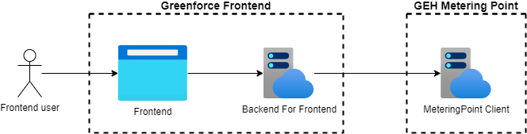

# Documentation

The Metering Point Client has been created with the sole purpose of exposing the HTTP endpoints for
the [Metering Point WebApi](../metering-point-client/documentation.md) in a convenient manner.

The client is made available as a Nuget package and is currently being used only by the frontend BFF (Backend For
Frontend) to access relevant MP data.

## Publishing to Nuget

This bundle is published as a [Nuget package](https://www.nuget.org/packages/Energinet.DataHub.MeteringPoints.Client).

Publishing a new package is handled through our build pipeline. To release a new version simply perform the relevant
changes to the client and bump the package version in both of the project files.

After the code has been merged with main remember to update the client version in the BFF.

## Bundle contents

The bundle contains the following packages:

* Energinet.DataHub.MeteringPoints.Client
* Energinet.DataHub.MeteringPoints.Client.Abstractions

## Diagram

